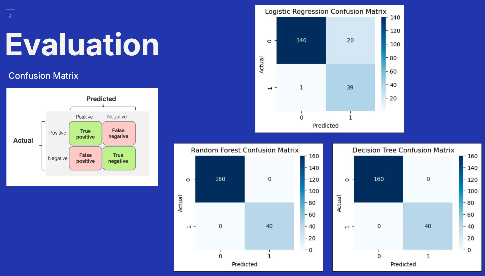

# PCOS Prediction using multiple models benchmark

## Project Overview

This project focuses on the prediction of Polycystic Ovary Syndrome (PCOS) using multiple machine learning models. The experimental analysis is conducted using the scikit-learn library to evaluate the performance of different models.


## Collaborators

- [@kennaruk](https://github.com/kennaruk)
- [@ifferrie](https://github.com/ifferrie)

## Dataset
- [PCOS Dataset](pcos_dataset.csv)


## Evaluation Results

The evaluation results of the models are depicted below:



## More Details

For a comprehensive understanding of the project, please refer to the final presentation document:

- [Final Presentation PDF](docs/nitipat_saowaluk_ML_final_presentation.pdf)

## Setup Instructions

To run the project, follow these steps:

1. **Install Jupyter Notebook**: Ensure you have Jupyter Notebook installed. You can install it using pip if it's not already installed:
   ```bash
   pip install notebook
   ```

2. **Install Required Libraries**: Make sure all the necessary Python libraries are installed. You can install the required libraries using the `requirements.txt` file provided in the project:
   ```bash
   pip install -r requirements.txt
   ```

3. **Run Jupyter Notebook**: Launch Jupyter Notebook by executing the following command in your terminal:
   ```bash
   jupyter notebook
   ```

4. **Open the Notebook**: In the Jupyter Notebook interface, navigate to the project directory and open `main.ipynb`.

5. **Execute the Notebook**: Run the cells in `main.ipynb` sequentially to execute the project.

Ensure your environment is set up correctly with all dependencies installed to avoid any issues during execution.
